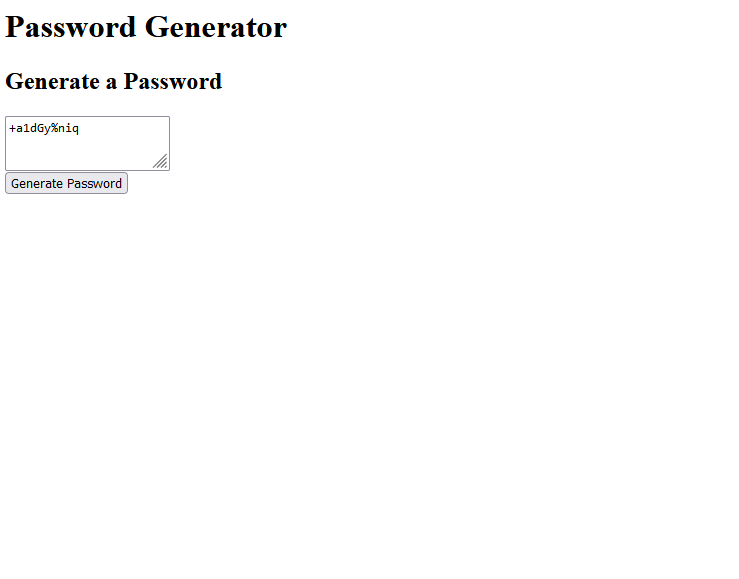

# Password Generator Starter Code

Challenge 3-- Random Password Generator 

    Created via VSCode 

    Utilizing javascript to create functions and logic to reach goal of creating a system that creates a randomized password 
    with numbers, letters, and special chracters

Project found on [GitHub](https://tristinnguyen.github.io/Challenge3-Password/)

